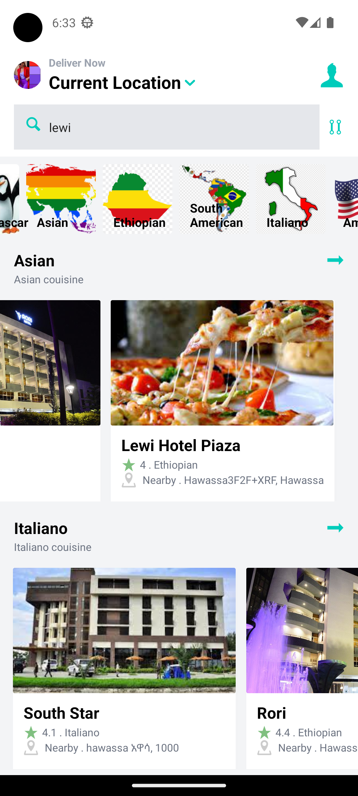
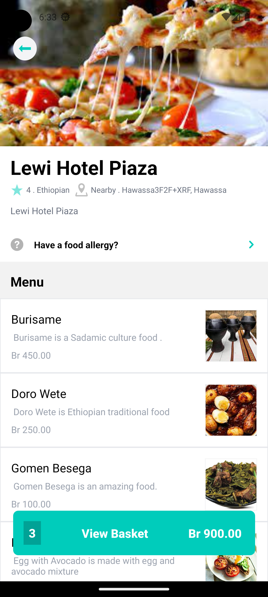
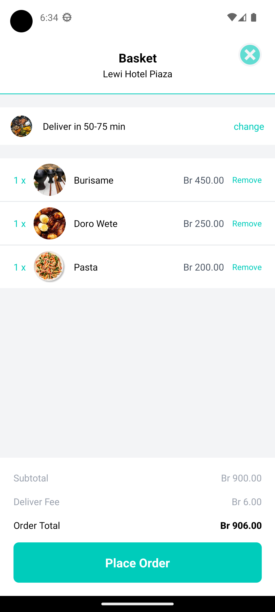
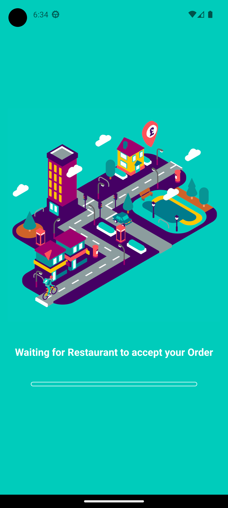
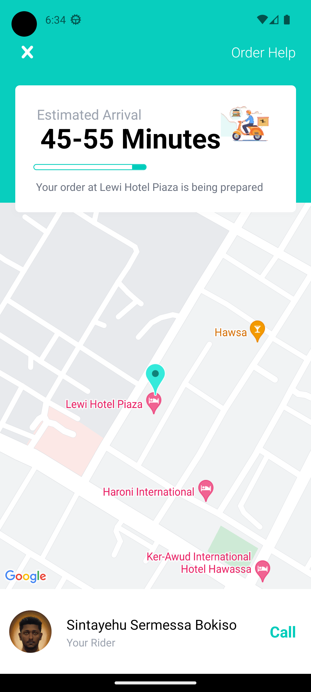
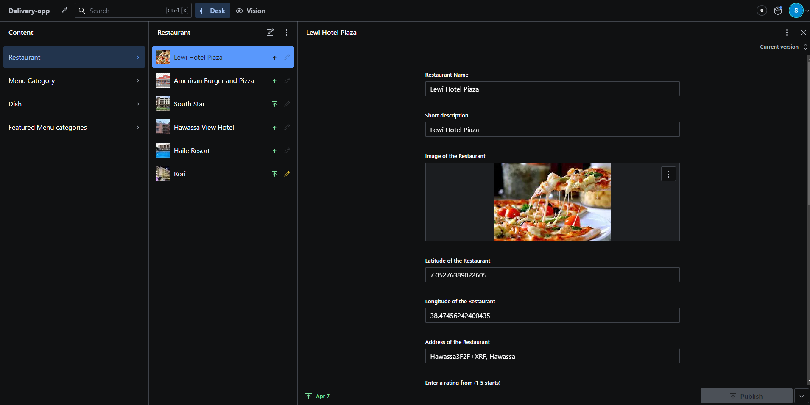

# Project Title

Delivery App

## Description

Delivery is a mobile application that I made with React Native and Sanity as a backend.Platform that connects customers with local restaurants and delivery services. Customers can browse through different cuisines and menus, order food online, track their delivery status. Restaurants can manage their inventory, menu, orders, and payments through a user-friendly dashboard.

I used React Native to create the front-end of the application, using components from React Native Elements and React Navigation. I used Sanity to create the backend of the application, using schemas, queries, mutations, and hooks , And the dashboard is sanity could management system . I used React Native Maps API to display the location of the restaurants. I used Expo to test and deploy the application.

## Access of the App Link

- `exp://exp.host/@sintayehu_sermessa/delivery_app?release-channel=default`

-

### Installation

- Clone this repository : `https://github.com/sintayehu-B/Delivery-app`

### Executing Program

- Start the projects : `npm expo start`

## Database

- I have Sanity to create the backend of the application and database, using schemas, queries, mutations, and hooks , And the dashboard is sanity could management system

## SnapShot Of The Delivery App

- # Home Page
- 
  # Restaurants Page
- 
  # Basket Page
- 
  # Loading Page
- 
  # Tracking Page
- 
  # DashBoard Page

- 
